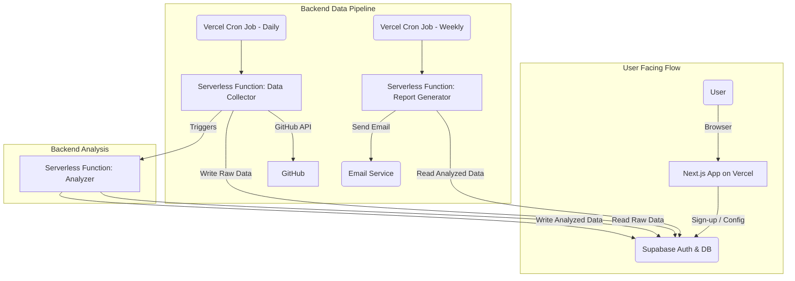
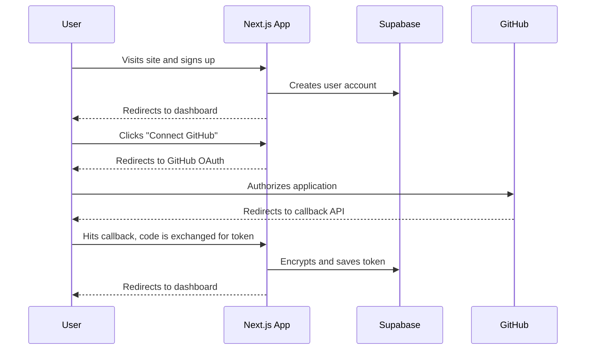
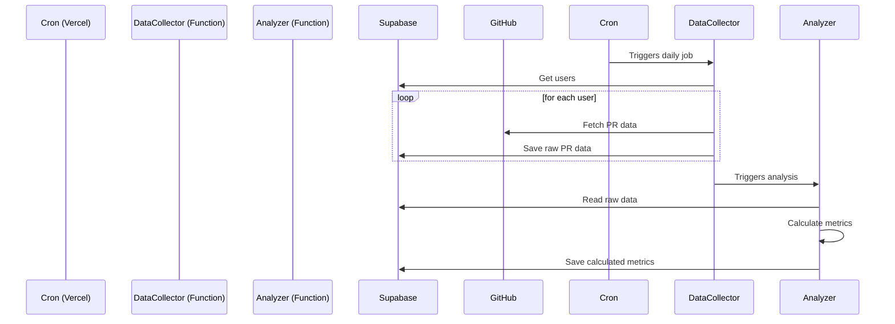

# "flow.dev" Fullstack Architecture Document

## 1. Introduction

This document outlines the complete fullstack architecture for **"flow.dev"**, including backend systems, frontend implementation, and their integration. It serves as the single source of truth for AI-driven development, ensuring consistency across the entire technology stack. This unified approach combines what would traditionally be separate backend and frontend architecture documents, streamlining the development process.

### Starter Template or Existing Project

Based on the PRD, this is a greenfield project built on a modern, specific tech stack (Next.js, Vercel, Supabase). To accelerate setup and ensure best practices from the start, I recommend using the official **Vercel Next.js starter template combined with the Supabase integration template**.

  * **Rationale**: This approach provides a pre-configured, production-ready foundation that includes server-side rendering (`@supabase/ssr`), environment variable setup, and authentication helpers. It directly aligns with the PRD's technical assumptions while saving significant initial setup time.

### Change Log

| Date | Version | Description | Author |
| :--- | :--- | :--- | :--- |
| Sep 22, 2025 | 1.0 | Initial architecture draft based on PRD v1.0 | Winston (Architect) |

-----

## 2. High Level Architecture

This section establishes the foundational architectural decisions for "flow.dev". The chosen approach is designed for rapid development, scalability, and operational simplicity, directly aligning with the MVP goals.

### Technical Summary

The architecture for "flow.dev" is a **serverless, Jamstack-style application**. The user-facing interface will be a **Next.js application** deployed on **Vercel**, providing a highly performant, statically-generated frontend with dynamic capabilities handled by serverless functions. The backend consists of two main parts: user-facing API routes for authentication and configuration, and a set of scheduled serverless functions (Vercel Cron Jobs) that execute the core data pipeline asynchronously. **Supabase** will provide the backend-as-a-service layer, handling the PostgreSQL database and user authentication.

### Platform and Infrastructure Choice

  * **Platform:** Vercel & Supabase
  * **Key Services:**
      * **Vercel:** Hosting, Serverless Functions (for API and data processing), Cron Jobs (for scheduling), Edge Network (CDN).
      * **Supabase:** PostgreSQL Database, Authentication, Secure Key Management.
  * **Deployment Regions:** Vercel's global edge network for the frontend, with the primary Supabase instance in a region chosen for data locality (e.g., US-East).

### Repository Structure

  * **Structure:** Monorepo
  * **Monorepo Tool:** `npm workspaces`
  * **Rationale:** The PRD specifies a monorepo. Using `npm workspaces` is the most lightweight and pragmatic approach for an MVP. It requires minimal configuration, is built into the Node.js ecosystem, and allows for easy sharing of types and utilities between the frontend application and any backend function packages.

### High Level Project Diagram



### Architectural and Design Patterns

  * **Serverless Architecture:** As specified in the PRD. This minimizes operational overhead and allows for a pay-per-use cost model that is ideal for an MVP. Vercel Functions will host all backend logic.
  * **Jamstack:** The frontend will be pre-rendered static assets where possible, with dynamic functionality provided by APIs (serverless functions). This pattern ensures maximum performance, security, and scalability.
  * **Repository Pattern:** Backend data access logic will be abstracted using the repository pattern. This decouples the business logic within our serverless functions from the Drizzle ORM, making the code more modular, easier to test, and simpler to maintain or migrate in the future.

-----

## 3. Tech Stack

The following table represents the **single source of truth** for all technologies used in the "flow.dev" project. The choices are derived directly from the PRD's technical assumptions and supplemented with industry-standard tooling to ensure a complete, modern, and maintainable stack. All development must adhere to these specific versions.

### Technology Stack Table

| Category | Technology | Version | Purpose | Rationale |
| :--- | :--- | :--- | :--- | :--- |
| **Frontend Framework** | Next.js | 14.2.3 | Core application framework | PRD specified. Enables performant, server-rendered React applications with a great developer experience. |
| **Styling** | Tailwind CSS | 3.4.3 | CSS framework for styling | PRD specified. Provides a utility-first approach for rapid and consistent UI development. |
| **UI Components** | HeroUI | 2.1.1 | Pre-built React components | PRD specified. Accelerates UI development by providing a set of accessible components. |
| **UI Animation** | Framer Motion | 11.1.9 | Animation library for React | PRD specified. Offers a simple and powerful API for creating fluid animations and micro-interactions. |
| **Database & Auth** | Supabase (Postgres) | 1.165.0 | Backend-as-a-Service | PRD specified. Provides a scalable Postgres database, authentication, and serverless functions out-of-the-box. |
| **ORM / DB Toolkit** | Drizzle ORM | 0.30.10 | TypeScript ORM for SQL | PRD specified. A lightweight, type-safe ORM that integrates well with Supabase and TypeScript. |
| **Server-Side Auth** | @supabase/ssr | 0.3.0 | Server-side Supabase helper | PRD specified. Simplifies secure handling of user sessions in a server-rendered Next.js environment. |
| **Unit Testing** | Jest & RTL | 29.7.0 | Component/function testing | Fulfills PRD's unit testing requirement. Industry standard for testing React applications. |
| **Integration Testing**| Playwright | 1.44.0 | End-to-end browser testing | Fulfills PRD's integration testing requirement. Recommended by Vercel for robust, cross-browser testing. |
| **Email Service** | Resend | 3.2.0 | Transactional email API | Fulfills Story 2.4 requirement. Modern API designed for React/Next.js with seamless Vercel integration. |
| **Linting / Formatting**| ESLint & Prettier | 9.2.0 / 3.2.5 | Code quality and style | Essential for maintaining code consistency, especially with AI-driven development. |
| **Deployment & Hosting**| Vercel | N/A | Application platform | PRD specified. Native platform for Next.js, providing CI/CD, hosting, and serverless functions. |
| **CI/CD** | GitHub Actions | N/A | Workflow automation | Vercel's CI/CD is triggered via Git. GitHub Actions can be used for any additional required checks. |

-----

## 4. Data Models

These are the primary data entities required to operate "flow.dev".

### User Profile

  * **Purpose:** To store application-specific data related to a user, extending the built-in Supabase `auth.users` table.
  * **Relationships:** A one-to-one relationship with the `auth.users` table.
  * **TypeScript Interface:**
    ```typescript
    export interface UserProfile {
      id: string; // UUID
      updated_at: string; // ISO 8601 timestamp
      report_email: string | null;
    }
    ```

### Repository

  * **Purpose:** To store the specific GitHub repositories that a user has selected for analysis.
  * **Relationships:** A `User Profile` can have many `Repositories`.
  * **TypeScript Interface:**
    ```typescript
    export interface Repository {
      id: string; // UUID
      user_id: string; // UUID
      github_repo_id: number;
      name: string;
      is_active: boolean;
    }
    ```

### Pull Request

  * **Purpose:** To store the essential, raw data for each pull request fetched from the GitHub API.
  * **Relationships:** A `Repository` can have many `PullRequests`.
  * **TypeScript Interface:**
    ```typescript
    export interface PullRequest {
      id: string; // UUID
      repository_id: string; // UUID
      github_pr_id: number;
      pr_number: number;
      title: string;
      author_username: string;
      created_at_ts: string; // ISO 8601 timestamp
      merged_at_ts: string | null;
      first_commit_ts: string | null;
    }
    ```

### PR Metric

  * **Purpose:** To store the calculated metrics and analytical insights derived from the raw pull request data.
  * **Relationships:** Each `PullRequest` has one `PRMetric`.
  * **TypeScript Interface:**
    ```typescript
    export interface PRMetric {
      id: string; // UUID
      pull_request_id: string; // UUID
      cycle_time_seconds: number;
      analysis_version: number;
      calculated_at: string; // ISO 8601 timestamp
    }
    ```

-----

## 5. API Specification

This OpenAPI 3.0 specification describes the user-facing RESTful API implemented via Next.js API Routes.

```yaml
openapi: 3.0.1
info:
  title: "flow.dev API"
  version: "1.0.0"
  description: "API for user management and configuration for the flow.dev application."
servers:
  - url: "/api"
    description: "Relative path for API routes"
paths:
  /user/profile:
    get:
      summary: "Get current user's profile"
      security:
        - cookieAuth: []
      responses:
        '200':
          description: "Successful response"
          content:
            application/json:
              schema:
                $ref: '#/components/schemas/UserProfile'
        '401':
          description: "Unauthorized"
    patch:
      summary: "Update user's profile"
      security:
        - cookieAuth: []
      requestBody:
        required: true
        content:
          application/json:
            schema:
              type: object
              properties:
                report_email:
                  type: string
                  format: email
      responses:
        '200':
          description: "Profile updated successfully"
          content:
            application/json:
              schema:
                $ref: '#/components/schemas/UserProfile'
        '400':
          description: "Bad Request - Invalid email format"
        '401':
          description: "Unauthorized"
components:
  schemas:
    UserProfile:
      type: object
      properties:
        id:
          type: string
          format: uuid
        report_email:
          type: string
          format: email
  securitySchemes:
    cookieAuth:
      type: apiKey
      in: cookie
      name: "sb-access-token"
```

-----

## 6. Components

This section breaks down the application into its major logical components.

### Frontend Components

  * **AuthUI:** Manages the user authentication experience (sign-up, sign-in, etc.).
  * **GitHubConnector:** Provides the UI for initiating the GitHub OAuth connection.
  * **ConfigurationForm:** Allows users to update their report delivery settings.

### Backend Components (Serverless Functions)

  * **API Handler:** Exposes the user-facing REST API.
  * **GitHubDataCollector:** Scheduled function to fetch pull request data.
  * **PR-Analyzer:** Processes raw PR data to calculate metrics.
  * **ReportGenerator & Emailer:** Scheduled function to generate and send the weekly report.

### Core Services

  * **DatabaseClient:** Manages the database connection and provides the Drizzle ORM client.
  * **AuthManager:** Manages user sessions and authentication state using Supabase Auth.

-----

## 7. External APIs

This section details the third-party APIs the application will integrate with.

### GitHub API

  * **Purpose:** To fetch repository and pull request data for analysis.
  * **Documentation:** `https://docs.github.com/en/rest`
  * **Authentication:** OAuth 2.0 (read-only permissions).

### Resend API

  * **Purpose:** To handle the delivery of the weekly insight reports.
  * **Documentation:** `https://resend.com/docs/api-reference/introduction`
  * **Authentication:** API Key.

-----

## 8. Core Workflows

### User Onboarding & GitHub Connection

This workflow covers the sequence from user sign-up to successfully connecting their GitHub account via OAuth.



### Scheduled Data Collection & Analysis

This workflow shows the asynchronous backend pipeline for processing data.



-----

## 9. Database Schema

This is the SQL DDL for the Supabase PostgreSQL database.

```sql
-- Stores application-specific user data.
CREATE TABLE app.user_profiles (
    id uuid PRIMARY KEY REFERENCES auth.users(id) ON DELETE CASCADE,
    updated_at timestamptz DEFAULT now(),
    report_email text,
    github_token_encrypted text
);
ALTER TABLE app.user_profiles ENABLE ROW LEVEL SECURITY;

-- Stores repositories a user wants to monitor.
CREATE TABLE app.repositories (
    id uuid PRIMARY KEY DEFAULT gen_random_uuid(),
    user_id uuid NOT NULL REFERENCES app.user_profiles(id) ON DELETE CASCADE,
    github_repo_id bigint NOT NULL,
    name text NOT NULL,
    is_active boolean DEFAULT true,
    created_at timestamptz DEFAULT now(),
    UNIQUE (user_id, github_repo_id)
);
CREATE INDEX idx_repositories_user_id ON app.repositories(user_id);
ALTER TABLE app.repositories ENABLE ROW LEVEL SECURITY;

-- Stores raw data for each fetched pull request.
CREATE TABLE app.pull_requests (
    id uuid PRIMARY KEY DEFAULT gen_random_uuid(),
    repository_id uuid NOT NULL REFERENCES app.repositories(id) ON DELETE CASCADE,
    github_pr_id bigint NOT NULL,
    pr_number integer NOT NULL,
    title text,
    author_username text,
    created_at_ts timestamptz,
    merged_at_ts timestamptz,
    first_commit_ts timestamptz,
    raw_payload jsonb,
    UNIQUE (repository_id, github_pr_id)
);
CREATE INDEX idx_pull_requests_repository_id ON app.pull_requests(repository_id);
ALTER TABLE app.pull_requests ENABLE ROW LEVEL SECURITY;

-- Stores calculated insights for each pull request.
CREATE TABLE app.pr_metrics (
    id uuid PRIMARY KEY DEFAULT gen_random_uuid(),
    pull_request_id uuid NOT NULL UNIQUE REFERENCES app.pull_requests(id) ON DELETE CASCADE,
    cycle_time_seconds integer,
    analysis_version integer NOT NULL,
    calculated_at timestamptz DEFAULT now()
);
CREATE INDEX idx_pr_metrics_pull_request_id ON app.pr_metrics(pull_request_id);
ALTER TABLE app.pr_metrics ENABLE ROW LEVEL SECURITY;
```

-----

## 10. Unified Project Structure

The project will use a standard `apps` and `packages` monorepo layout, managed by `npm workspaces`.

```plaintext
flow-dev/
├── apps/
│   ├── web/                # Next.js frontend and user-facing API
│   └── cron/               # Backend data processing functions
├── packages/
│   ├── db/                 # Drizzle ORM schema and database client
│   ├── shared-types/       # Shared TypeScript interfaces
│   └── config/             # Shared configs (ESLint, etc.)
├── package.json            # Root workspaces config
└── README.md
```

