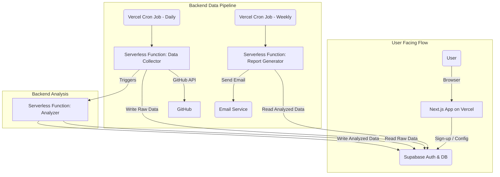

# 2. High Level Architecture

This section establishes the foundational architectural decisions for "flow.dev". The chosen approach is designed for rapid development, scalability, and operational simplicity, directly aligning with the MVP goals.

## Technical Summary

The architecture for "flow.dev" is a **serverless, Jamstack-style application**. The user-facing interface will be a **Next.js application** deployed on **Vercel**, providing a highly performant, statically-generated frontend with dynamic capabilities handled by serverless functions. The backend consists of two main parts: user-facing API routes for authentication and configuration, and a set of scheduled serverless functions (Vercel Cron Jobs) that execute the core data pipeline asynchronously. **Supabase** will provide the backend-as-a-service layer, handling the PostgreSQL database and user authentication.

## Platform and Infrastructure Choice

  * **Platform:** Vercel & Supabase
  * **Key Services:**
      * **Vercel:** Hosting, Serverless Functions (for API and data processing), Cron Jobs (for scheduling), Edge Network (CDN).
      * **Supabase:** PostgreSQL Database, Authentication, Secure Key Management.
  * **Deployment Regions:** Vercel's global edge network for the frontend, with the primary Supabase instance in a region chosen for data locality (e.g., US-East).

## Repository Structure

  * **Structure:** Monorepo
  * **Monorepo Tool:** `npm workspaces`
  * **Rationale:** The PRD specifies a monorepo. Using `npm workspaces` is the most lightweight and pragmatic approach for an MVP. It requires minimal configuration, is built into the Node.js ecosystem, and allows for easy sharing of types and utilities between the frontend application and any backend function packages.

## High Level Project Diagram

## Architectural and Design Patterns

  * **Serverless Architecture:** As specified in the PRD. This minimizes operational overhead and allows for a pay-per-use cost model that is ideal for an MVP. Vercel Functions will host all backend logic.
  * **Jamstack:** The frontend will be pre-rendered static assets where possible, with dynamic functionality provided by APIs (serverless functions). This pattern ensures maximum performance, security, and scalability.
  * **Repository Pattern:** Backend data access logic will be abstracted using the repository pattern. This decouples the business logic within our serverless functions from the Drizzle ORM, making the code more modular, easier to test, and simpler to maintain or migrate in the future.

-----
