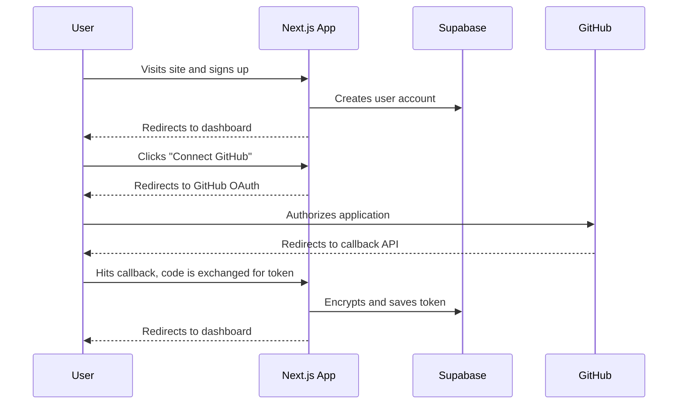
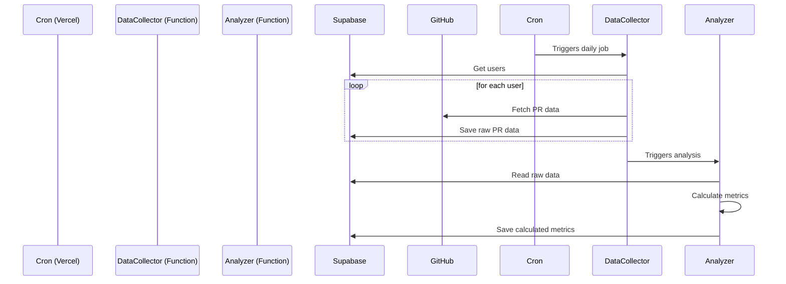

# 8. Core Workflows

## User Onboarding & GitHub Connection

This workflow covers the sequence from user sign-up to successfully connecting their GitHub account via OAuth.

## Scheduled Data Collection & Analysis

This workflow shows the asynchronous backend pipeline for processing data.

-----
